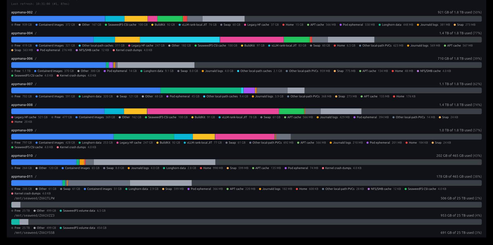

# kubernetes-storage-dashboard-grafana

Per-node storage breakdown for Kubernetes. iPhone-Settings-style
stacked bars, one row per (node, mountpoint), one segment per
storage category.



## The three pieces

1. Prometheus exporter. DaemonSet, container image, Helm chart. Emits
   per-node, per-category storage metrics on /metrics.
2. Grafana panel plugin (appmana-storage-breakdown-panel). TypeScript +
   React. Distributed as a .zip release asset. Loaded by Grafana
   through the standard panel SDK.
3. Dashboard JSON (uid storage-usage). Wires the plugin to the
   exporter's metrics through four PromQL targets. Shipped as a
   ConfigMap labelled grafana_dashboard.

Each piece works in isolation. Install one, two, or all three.

## Metrics

```
nsd_node_storage_bytes{node, mountpoint, category} <bytes>
nsd_node_filesystem_size_bytes{node, mountpoint} <bytes>
nsd_node_filesystem_used_bytes{node, mountpoint} <bytes>
```

Prefix nsd_ is configurable via the exporter.metricPrefix Helm value.

Built-in categories: containerd-images, pod-ephemeral,
local-path-pvc, local-path-cache, longhorn, swap, apt-cache,
fscache, journald, crash-dumps, snap, buildkit, dockerd, home.

## Measurement sources

| Category | Source | Cost |
|---|---|---|
| containerd-images | kubelet /stats/summary, imageFs.usedBytes | < 1 s |
| pod-ephemeral | kubelet /stats/summary, sum of pods[*].ephemeral-storage.usedBytes | < 1 s |
| longhorn | Longhorn /metrics, joined as longhorn_replica_info * longhorn_volume_actual_size_bytes | < 1 s |
| swap | /proc/swaps | instant |
| filesystem size + used | statvfs() on real block-device mountpoints (ext4, btrfs, xfs) | instant |
| apt-cache, journald, home, ... | Bounded du -sx --block-size=1 under nice -n 19 ionice -c 3, 30 s timeout | < 5 s |
| Per-PVC local-path directories | Enum walk under /opt/local-path-provisioner (configurable), one du per PVC | < 5 s |

### du --block-size=1, not -b

Allocated bytes on disk. Matches df on btrfs+zstd and on Longhorn
sparse replicas.

### longhorn metric source

The chart joins longhorn_replica_info with
longhorn_volume_actual_size_bytes. This counts replica bytes only.

### Synthetic mountpoint labels

Kubelet's /stats/summary reports imageFs.usedBytes and per-pod
ephemeral-storage.usedBytes with a synthetic mountpoint. The
exporter emits them with mountpoint="imageFs" and
mountpoint="ephemeral". The panel plugin remaps them to / (or the
first available mountpoint on that node) at render time.

## Install

### Prerequisites

- Kubernetes 1.27+
- Prometheus + ServiceMonitor CRD (kube-prometheus-stack)
- Grafana 10.4+ (12.3+ tested in production) with the
  grafana_dashboard ConfigMap sidecar
- Grafana pod egress to github.com for the plugin .zip
- Longhorn for the longhorn segment (optional)

### Step 1: panel plugin

Add to your kube-prometheus-stack values, then
helm upgrade kube-prometheus-stack:

```yaml
grafana:
  plugins: []
  env:
    GF_PLUGINS_PREINSTALL: "appmana-storage-breakdown-panel@0.1.1@https://github.com/AppMana/kubernetes-storage-dashboard-grafana/releases/download/v0.1.1/appmana-storage-breakdown-panel-0.1.1.zip"
  grafana.ini:
    plugins:
      allow_loading_unsigned_plugins: appmana-storage-breakdown-panel
```

Three fields, three jobs:

- GF_PLUGINS_PREINSTALL is the Grafana 12.3+ install-from-URL path.
  The background installer fetches and unpacks the .zip into
  /var/lib/grafana/plugins/ on pod startup.
- plugins: [] clears the chart's GF_INSTALL_PLUGINS configmap key.
  Required so Grafana 12.3+ uses the env path above.
- allow_loading_unsigned_plugins whitelists this plugin. v0.1.x
  releases ship unsigned.

### Step 1a: combining multiple plugins

GF_PLUGINS_PREINSTALL accepts a comma-separated list. Each item is
`<id>@<version>@<url>` for an external .zip, or just `<id>` for a
plugin from the Grafana catalog. Mix freely:

```yaml
grafana:
  plugins: []
  env:
    GF_PLUGINS_PREINSTALL: >-
      marcusolsson-json-datasource,
      grafana-clock-panel@2.1.7,
      appmana-storage-breakdown-panel@0.1.1@https://github.com/AppMana/kubernetes-storage-dashboard-grafana/releases/download/v0.1.1/appmana-storage-breakdown-panel-0.1.1.zip
  grafana.ini:
    plugins:
      allow_loading_unsigned_plugins: appmana-storage-breakdown-panel
```

allow_loading_unsigned_plugins is also comma-separated. Add every
unsigned plugin ID:

```yaml
grafana.ini:
  plugins:
    allow_loading_unsigned_plugins: some-other-unsigned-id,appmana-storage-breakdown-panel
```

Catalog plugins (the bare-ID entries) are signed by Grafana Labs.
They load with no allow_loading_unsigned_plugins entry.

### Step 2: chart (exporter + dashboard ConfigMap)

```bash
helm install kubernetes-storage-dashboard-grafana \
  oci://ghcr.io/appmana/charts/kubernetes-storage-dashboard-grafana \
  --version 0.1.1 \
  --namespace monitoring --create-namespace
```

To pin the metric prefix (migration from an existing exporter):

```bash
helm install kubernetes-storage-dashboard-grafana \
  oci://ghcr.io/appmana/charts/kubernetes-storage-dashboard-grafana \
  --version 0.1.1 \
  --namespace monitoring \
  --set exporter.metricPrefix=appmana
```

### Step 2 (alt): Kustomize

```bash
kubectl apply -k https://github.com/appmana/kubernetes-storage-dashboard-grafana//deploy/kustomize?ref=v0.1.1
```

Or install.yaml from the GitHub release page.

### Step 3: Flux GitOps

```yaml
---
apiVersion: source.toolkit.fluxcd.io/v1beta2
kind: HelmRepository
metadata:
  name: kubernetes-storage-dashboard-grafana
  namespace: monitoring
spec:
  type: oci
  interval: 1h
  url: oci://ghcr.io/appmana/charts
---
apiVersion: helm.toolkit.fluxcd.io/v2beta1
kind: HelmRelease
metadata:
  name: kubernetes-storage-dashboard-grafana
  namespace: monitoring
spec:
  interval: 10m
  chart:
    spec:
      chart: kubernetes-storage-dashboard-grafana
      version: "0.1.1"
      sourceRef:
        kind: HelmRepository
        name: kubernetes-storage-dashboard-grafana
        namespace: monitoring
      interval: 1h
  values:
    exporter:
      metricPrefix: appmana    # match your prefix
    longhorn:
      serviceMonitor:
        enabled: true          # if Longhorn is installed
```

### Verify

```bash
# DaemonSet rolled out
kubectl -n monitoring rollout status ds/kubernetes-storage-dashboard-grafana

# Metrics on the wire
kubectl -n monitoring port-forward ds/kubernetes-storage-dashboard-grafana 9101 &
curl -s localhost:9101/metrics | head -20

# Plugin file present in each Grafana pod
for p in $(kubectl -n monitoring get pods -l app.kubernetes.io/name=grafana -o name); do
  echo "$p"
  kubectl -n monitoring exec $p -c grafana -- ls /var/lib/grafana/plugins/appmana-storage-breakdown-panel/
done

# Per-category series counts in Prometheus
kubectl -n monitoring port-forward svc/kube-prometheus-stack-prometheus 9090:9090 &
curl -s 'http://localhost:9090/api/v1/query?query=count+by+(category)(nsd_node_storage_bytes)' \
  | jq -r '.data.result[] | "  \(.metric.category): \(.value[1]) series"'
```

Open /d/storage-usage in Grafana.

### Recovering from a failed install

Symptom in the Grafana pod log:

```
plugin.backgroundinstaller "Failed to install plugins"
error="...: 404: /plugins/<long-string>/versions does not exist (Grafana v12.3.0)"
```

Cause: the configmap key `plugins` is set from an earlier install
that used `grafana.plugins: ["...zip"]`. Grafana 12.3+ rejects the
`<name>@<version>@<url>` syntax in GF_INSTALL_PLUGINS.

Fix:

1. Clear the configmap key:
   ```bash
   kubectl -n monitoring patch cm kube-prometheus-stack-grafana \
     --type=json -p='[{"op":"replace","path":"/data/plugins","value":""}]'
   ```
2. In kube-prometheus-stack values, set `grafana.plugins: []` and
   move the URL into env.GF_PLUGINS_PREINSTALL (see Step 1).
3. Delete the crashlooping Grafana pod. The deployment recreates it
   with the new env.

## Custom categories

Six lines of Helm values add a category. Python source goes in the
chart values, the chart mounts it as a ConfigMap, the exporter loads
it on startup.

```yaml
# values-overlay.yaml
exporter:
  plugins:
    my_app.py: |
      from exporter.categories.base import DuPathCategory

      class MyAppCacheCategory(DuPathCategory):
          name = "my-app-cache"
          path = "/var/lib/my-app/cache"

  categories:
    - { type: Filesystem }
    - { type: ContainerdImages }
    - { type: PodEphemeral }
    - { type: Swap }
    - { type: AptCache }
    - { type: Journald }
    - { type: Home }
    - { type: LocalPathProvisioner }
    - { type: MyAppCache }
```

helm upgrade -f values-overlay.yaml. The new my-app-cache series
appears at the next scrape.

### Base classes

- DuPathCategory. One fixed host path, walked with du -sx. Set
  name, path.
- EnumDirPathCategory. Directory-of-directories. Classify each
  subdirectory by name. Set root, default_category. Optional
  parse_regex, rules.
- KubeletStatCategory. One number from kubelet /stats/summary.
  Multiple subclasses share one HTTP call per cycle. Set name,
  mountpoint_label. Override extract(stats).
- BaseCategory. Custom file parsing, multiple paths, branching
  logic. Override collect(ctx). Yield
  StorageSample(category, mountpoint, bytes).

Full BaseCategory example:

```yaml
exporter:
  plugins:
    multi_tenant_cache.py: |
      from exporter.categories.base import BaseCategory, StorageSample
      from exporter import utils

      class MultiTenantCacheCategory(BaseCategory):
          """Sums per-tenant cache dirs under /var/lib/my-app/tenants/*/cache."""
          name = "tenant-cache"

          def collect(self, ctx):
              for tenant in utils.list_host_dir("/var/lib/my-app/tenants"):
                  cache = f"/var/lib/my-app/tenants/{tenant}/cache"
                  if not utils.host_is_dir(cache):
                      continue
                  sz = utils.du_bytes(cache, ctx.du_timeout_seconds)
                  if sz is None:
                      continue
                  yield StorageSample(
                      category=self.name,
                      mountpoint=utils.host_mountpoint(cache),
                      bytes=sz,
                  )
```

### Plugin author conventions

- The host filesystem is mounted at /host inside the pod. Helpers
  in exporter.utils (du_bytes, host_mountpoint, list_host_dir,
  host_is_dir, statvfs) take a host-side path and handle the prefix.
- A category that yields zero samples ships cluster-wide cleanly.
- The framework catches exceptions per category. One broken category
  skips its cycle, the rest continue.

### Inline categories

```yaml
exporter:
  categories:
    - { type: DuPath, name: my-app-cache, path: /var/lib/my-app/cache }
    - type: EnumDirPath
      root: /mnt/seaweed
      parse_regex: '^(?P<volume>.+)$'
      default_category: seaweedfs-volume-data
```

### Disable a built-in

categories: replaces the list wholesale. Re-list everything you want
to keep, omit what you want gone.

### Reference: AppMana production config

[examples/appmana.yaml](examples/appmana.yaml) is the production
config used in the cluster this exporter was extracted from. It adds
seaweedfs-volume-data, vllm-jit-local, comfyui-custom-nodes-cache,
comfyui-custom-nodes-snapshot, hf-cache, seaweedfs-csi-cache, and a
relocated local-path provisioner root.

## Repo layout

```
exporter/
  categories/
    base.py                   ABC, DuPathCategory, EnumDirPathCategory, KubeletStatCategory
    filesystem.py             statvfs(), emits FilesystemSample
    swap.py                   /proc/swaps
    containerd_images.py      kubelet /stats/summary, imageFs.usedBytes
    pod_ephemeral.py          kubelet /stats/summary, sum(pods.ephemeral-storage)
    apt_cache.py              du /var/cache/apt
    journald.py               du /var/log/journal
    home.py, snap.py, ...     one-line DuPathCategory subclasses
    local_path_provisioner.py EnumDirPathCategory for per-PVC dirs
  utils.py                    du_bytes, host_mountpoint, statvfs, fetch_kubelet_stats
  plugin_loader.py            Imports user .py files from plugins_dir
  config.py                   YAML loader, categories[] instantiation
  server.py                   Threading HTTP /metrics + collection loop
  defaults.yaml               Default config

panel-plugin/
  src/module.ts               PanelPlugin registration
  src/components/             StorageBreakdownPanel, DiskRow, Legend
  src/transform.ts            Prometheus frames -> RowModel[]
  src/types.ts                PanelOptions

deploy/
  helm/                       Helm chart
  kustomize/                  Pre-rendered install.yaml
```

DaemonSet runtime: root user, hostPID true, read-only / hostPath at
/host. Startup imports every .py under
/etc/storage-exporter/plugins.d/, instantiates each
config.categories[] entry, runs the collection loop every
interval_seconds, serves /metrics on port 9101.

Panel plugin runtime: Grafana loads it on startup, treats it as a
panel type. Standard time picker, variables, drill-down, share
links, snapshots all work.

## Packaging

Push a v*.*.* git tag.
[.github/workflows/release.yaml](.github/workflows/release.yaml):

1. Multi-arch container image (linux/amd64, linux/arm64) to
   ghcr.io/appmana/kubernetes-storage-dashboard-grafana:VERSION,
   :MAJOR.MINOR, :latest. Provenance + SBOM attached.
2. Helm chart to
   oci://ghcr.io/appmana/charts/kubernetes-storage-dashboard-grafana.
   Chart version and appVersion rewritten to match the tag.
3. install.yaml rendered at the tag, attached to the GH release
   alongside the chart tarball and the plugin .zip.

CI ([.github/workflows/ci.yaml](.github/workflows/ci.yaml)) on
every PR and push:

- Python: ruff check, mypy --strict, pytest --cov
- YAML: yamllint
- Dashboard: render template against default + AppMana category
  lists, JSON-parse
- Helm: helm lint, helm template, kubeconform -strict
- Drift gate: re-render install.yaml and diff -u against the
  committed copy
- Docker: full docker buildx + --help smoke test
- Panel plugin: yarn typecheck, yarn test:ci, yarn build

Regenerate
[deploy/kustomize/install.yaml](deploy/kustomize/install.yaml):

```bash
helm template kubernetes-storage-dashboard-grafana \
  deploy/helm/kubernetes-storage-dashboard-grafana \
  --namespace monitoring > deploy/kustomize/install.yaml
```

## Security

DaemonSet:

- runAsUser: 0. Required for /proc/swaps, /proc/1/mounts, and most
  /var/lib/* paths the du collector walks.
- hostPID: true. The pod sees the host's /proc/1/mounts.
- hostPath / mounted read-only at /host with HostToContainer
  propagation.
- privileged: false, default capability set, default network
  namespace.

RBAC:

```yaml
rules:
  - apiGroups: [""]
    resources: ["nodes/proxy", "nodes/stats"]
    verbs: ["get"]
```

### Plugin trust

exporter.plugins runs arbitrary Python inside a root pod with
hostPath access. Same trust boundary as the DaemonSet image.

## License

Apache-2.0. See [LICENSE](LICENSE).
